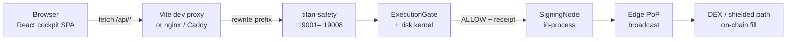

# Beginner Guide: Web UI Live + Real Crypto Money

> **Who this is for:** Someone who has never shipped a trading cockpit before, and wants one clear path from “I cloned the repo” to “the web UI talks to real backends” and then — only if they choose — to “real crypto / real money can move under Titan’s gates.”
>
> **What this document is:** The **one beginner tutorial** that bridges (1) Cockpit web UI → production serve, (2) data providers mock → live, and (3) the honest real-capital path (paper → shadow → Phase 5 YES → risk kernel → signing → edge).
>
> **What this document is not:** A silent enablement of live trading. Reading or following the UI sections does **not** authorize capital. Flipping Settings → Live does **not** move money.

---

## The one sentence you must remember

**UI “live” ≠ capital live.**

| Phrase you hear | What it actually means |
|-----------------|------------------------|
| Cockpit `VITE_DATA_MODE=live` | The React app fetches `/api/*` from titan-safety ports instead of only reading fixtures |
| Green Health page | Safety units answered (or soft-fail showed fixtures with an advisory label) |
| BFT 2-of-3 ALLOW | Agents voted — **advisory only** |
| Risk kernel `:19001` DENY | **Authoritative** — nothing in the UI can override this |
| Phase 5 human YES | Hyperion explicitly approved a promotion subject for live capital |
| Real money moving | Gate ALLOW + fresh receipt + in-process sign + edge broadcast on a shielded DEX path |

If you only remember one thing from this entire guide, remember that table.

---

## Related docs (optional deeper reading)

This file is designed to **stand alone**. If you want more depth later:

| Doc | Role |
|-----|------|
| [`WEB_UI_LIVE_PRODUCTION_GUIDE.md`](./WEB_UI_LIVE_PRODUCTION_GUIDE.md) | Shorter UI production serve guide |
| [`WEB_UI_DATA_PROVIDERS_LIVE_GUIDE.md`](./WEB_UI_DATA_PROVIDERS_LIVE_GUIDE.md) | Providers-only deep dive |
| [`LIVE_CAPITAL_PRODUCTION_GUIDE.md`](./LIVE_CAPITAL_PRODUCTION_GUIDE.md) | Full real-capital ceremony |
| [`PRODUCTION_READINESS.md`](./PRODUCTION_READINESS.md) | Honest residual risks |
| [`SYSTEM.md`](./SYSTEM.md) | Full system manual (ports §10, cockpit §11) |
| [`web/README.md`](./web/README.md) | Quick start |

---

## Table of contents

- [Part A — Big picture](#part-a--big-picture)
  - [A1. What the cockpit shows vs what moves money](#a1-what-the-cockpit-shows-vs-what-moves-money)
  - [A2. End-to-end diagram](#a2-end-to-end-diagram)
  - [A3. Three layers of “live”](#a3-three-layers-of-live)
  - [A4. Classical-only fleet facts](#a4-classical-only-fleet-facts)
- [Part B — Data providers deep dive](#part-b--data-providers-deep-dive)
  - [B0. Provider architecture (how the seam works)](#b0-provider-architecture-how-the-seam-works)
  - [B1. Health (`getHealth`)](#b1-health-gethealth)
  - [B2. Fleet / agents (`getFleet`)](#b2-fleet--agents-getfleet)
  - [B3. Signing status (`getSigning`)](#b3-signing-status-getsigning)
  - [B4. Security (`getSecurity`)](#b4-security-getsecurity)
  - [B5. Portfolio (`getPortfolio`)](#b5-portfolio-getportfolio)
  - [B6. Pipelines (`getPipelines`)](#b6-pipelines-getpipelines)
  - [B7. Manual Control (`getManualControl`)](#b7-manual-control-getmanualcontrol)
  - [B8. Pages still on `data.ts` fixtures (migrate later)](#b8-pages-still-on-datats-fixtures-migrate-later)
  - [B9. How to implement a new live fetch (step-by-step)](#b9-how-to-implement-a-new-live-fetch-step-by-step)
  - [B10. How to verify in the browser Network tab](#b10-how-to-verify-in-the-browser-network-tab)
- [Part C — Env & build for production UI](#part-c--env--build-for-production-ui)
- [Part D — Real crypto & real money](#part-d--real-crypto--real-money)
- [Part E — End-to-end checklist](#part-e--end-to-end-checklist)
- [Part F — Troubleshooting](#part-f--troubleshooting)
- [Part G — Glossary](#part-g--glossary)
- [Honest blockers (this repo, today)](#honest-blockers-this-repo-today)

---

# Part A — Big picture

## A1. What the cockpit shows vs what moves money

Imagine an airplane cockpit. The gauges tell you altitude, fuel, and engine temperature. They do **not** fly the plane by themselves. The Titan Agentik web UI (`web/`) is that cockpit.

### What the web UI is good for

- Seeing whether safety services (`:19001`–`:19008`) are reachable
- Inspecting a 20-agent classical fleet roster
- Driving operator surfaces: Manual Control, Security Ops, Promotions, Health & Verify
- Toggling **mock vs live data providers** (Settings)
- Storing a session **HMAC** token for mutating control-plane calls
- Watching advisory labels so you do not confuse fixtures with capital truth

### What the web UI is *not*

- It is **not** the risk kernel
- It is **not** the signer
- It is **not** a wallet that holds private keys in the browser
- It is **not** a “go live” button for real money
- It cannot override a kernel **DENY**

### What actually moves money (when armed)

1. Agents (ORACLE, PREDATOR, …) **propose** a trade.
2. Optional TradingAgents-style debate + BFT votes (AUGUR + PREDATOR + ATLAS) — **advisory**.
3. **ExecutionGate** runs reconciliation (`:19002`) → risk kernel (`:19001`) → portfolio risk (`:19004` when wired).
4. On ALLOW, a short-lived **`X-Titan-Gate-Receipt`** is issued.
5. **In-process** `titan_safety.SigningNode` signs via `titan-safety gate sign` (default — **no** mandatory `:19010` daemon).
6. An **edge PoP** (FRA / TKY / SIN / USE / AMS) broadcasts on a **MEV-shielded** DEX path.
7. Reconciliation checks believed vs actual positions.

If any stage fails or is unreachable → **fail-closed DENY**. There is no “production urgency bypass.”

> **Warning:** A green cockpit with soft-fail fixtures can look healthy while backends are down. Always curl the safety ports yourself before trusting capital decisions.

---

## A2. End-to-end diagram

### Mermaid (browser → chain)



### ASCII (same story, copy-paste friendly)

```text
┌──────────────────────────────┐
│  Browser (cockpit SPA)       │
│  web/src React routes        │
│  Settings: mock | live       │
└──────────────┬───────────────┘
               │  GET/POST /api/...
               ▼
┌──────────────────────────────┐
│  Dev:  Vite proxy (5173)     │
│  Prod: nginx / Caddy         │  ← must strip /api/<name> prefix
└──────────────┬───────────────┘
               │
               ▼
┌──────────────────────────────┐
│  titan-safety HTTP units     │
│  :19001 risk kernel          │
│  :19002 reconciliation       │
│  :19003 status aggregator    │
│  :19004 portfolio risk       │
│  :19005 dead-man's switch    │
│  :19006 allocator            │
│  :19007 TCA                  │
│  :19008 security ops         │
│  Signing: IN-PROCESS         │
│  (legacy :19010 optional)    │
└──────────────┬───────────────┘
               │  ALLOW + X-Titan-Gate-Receipt
               ▼
┌──────────────────────────────┐
│  titan-safety SigningNode    │
│  (TITANHOME, after gate)     │
└──────────────┬───────────────┘
               │
               ▼
┌──────────────────────────────┐
│  Edge mesh (5 PoPs)          │
│  FRA TKY SIN USE AMS         │
└──────────────┬───────────────┘
               │
               ▼
┌──────────────────────────────┐
│  Shielded DEX / intent /     │
│  Jito / Flashbots Protect    │
│  = real crypto fill          │
└──────────────────────────────┘
```

Mac Mini vault holds key **metadata** + **Trezor ceremonies**. Hot-path signing is colocated on TITANHOME inside titan-safety — not in the React app, not in an LLM process.

---

## A3. Three layers of “live”

Beginners get confused because the word “live” is overloaded. Titan uses three different meanings:

| Layer | Name | Controlled by | Moves money? |
|-------|------|---------------|--------------|
| **1. Mock fixtures** | `VITE_DATA_MODE=mock` (default) | Env + Settings | No — UI shows `data.ts` demo numbers |
| **2. Live data providers** | `VITE_DATA_MODE=live` | Env baked at build + session override | No — UI calls `/api/*`; soft-fails to fixtures |
| **3. Live capital** | `capital_profile: live` + Phase 5 YES + adapters + UPS | Policy, promotion audit, env secrets | **Yes** — only after gates |

```text
Mock fixtures ──► Live /api/* providers ──► Live capital
   (safe demo)      (instrument panel)        (real money)
```

You can (and should) complete layers 1→2 long before layer 3.

---

## A4. Classical-only fleet facts

Do not regress these:

- **20 agents** total. Quantum agents **QCC / QSA / QRP are removed**.
- QI Optimizer page = classical simulated annealing, **advisory only** (`live_path=false`).
- Signing default = **in-process** via `titan-safety gate sign`. Legacy HTTP `:19010` is **optional / not required**.
- DEX-only live posture (R02 / R46) — no CEX-direct live path.
- No closed/cloud models on live voters or execution (TRENCH-OPS / GUARDIAN stay Tier 1/2).

---

# Part B — Data providers deep dive

This part teaches you how the cockpit gets its numbers. You will learn every provider module that exists today, what it fetches, and how to wire more.

## B0. Provider architecture (how the seam works)

### Folder map

```text
web/src/lib/providers/
  types.ts          # shared DTOs (TypeScript shapes)
  mode.ts           # VITE_DATA_MODE + sessionStorage override
  http.ts           # soft-fail fetchJson (default 2.5s timeout)
  create.ts         # createProviders({ mode }) → mock | live
  mock/index.ts     # fixtures from web/src/lib/data.ts
  live/index.ts     # /api/* adapters ← wire real backends here
  context.tsx       # React DataProvider + hooks
  index.ts          # public exports
```

### Mental model in one paragraph

Pages should not hard-code `fetch` forever. Instead they call hooks like `useHealth()` / `useFleet()`. Those hooks ask a **provider object** for data. `createProviders()` returns either `mockProviders` or `liveProviders` based on mode. Mock always wraps fixtures from `data.ts`. Live tries HTTP; on any error it **soft-fails** — returns fixture data with `source: "live"`, `advisory: true`, and an `error` string — so the UI never crashes during bring-up.

### Soft-fail envelope (`ProviderResult<T>`)

From `types.ts`:

```ts
type ProviderResult<T> = {
  data: T;
  source: "mock" | "live";
  advisory: boolean;   // true = fixture / not authoritative capital
  error?: string;
  fetchedAt: string;   // ISO timestamp
};
```

The helper `advisoryLabel(result)` shows chips like `ADVISORY · mock` or `LIVE` or `ADVISORY · live fallback`.

### Mode resolution

From `mode.ts`:

1. Session override in `sessionStorage` key `titan.dataMode` (Settings toggle) **wins**
2. Else env `VITE_DATA_MODE` (`mock` | `live`)
3. Default: **`mock`**

> **Warning:** Vite bakes `VITE_*` at **build time**. Changing `.env.production` after `npm run build` does nothing until you rebuild. Session override works without rebuild but clears when the tab closes.

### Env vars

| Variable | Meaning |
|----------|---------|
| `VITE_DATA_MODE` | `mock` (default) or `live` |
| `VITE_API_BASE` | Optional absolute origin. Empty = same-origin relative `/api/*` (preferred behind reverse proxy) |

### Vite proxy map (dev source of truth)

From `web/vite.config.ts` — production nginx/Caddy must **mirror** this:

| UI path prefix | Upstream | Service |
|----------------|----------|---------|
| `/api/risk` | `127.0.0.1:19001` | Risk kernel |
| `/api/recon` | `127.0.0.1:19002` | Reconciliation |
| `/api/status` | `127.0.0.1:19003` | Status aggregator |
| `/api/portfolio` | `127.0.0.1:19004` | Portfolio risk |
| `/api/dms` | `127.0.0.1:19005` | Dead-man's switch |
| `/api/allocator` | `127.0.0.1:19006` | Capital allocator |
| `/api/tca` | `127.0.0.1:19007` | TCA / execution quality |
| `/api/security` | `127.0.0.1:19008` | Security Ops |
| `/api/signing` | `127.0.0.1:19003` | Signing halt status (in-process) |
| `/api/sign` | `127.0.0.1:19010` | Legacy HTTP signing (**optional**) |

**Rewrite rule:** strip the `/api/<name>` prefix before forwarding.

| Browser requests | Upstream receives |
|------------------|-------------------|
| `GET /api/status/health` | `GET http://127.0.0.1:19003/health` |
| `GET /api/security/v1/status` | `GET http://127.0.0.1:19008/v1/status` |

### Migrated pages today (use provider hooks)

| Page | Hook(s) |
|------|---------|
| Dashboard | `useHealth`, `usePortfolioProvider` |
| Health & Verify | `useHealth` |
| Agent Manager | `useFleet` |
| Signing | `useSigning` |
| Security Ops | `useSecurityProvider` |
| Pipelines | `usePipelinesProvider` |
| Manual Control | `useManualControlProvider` |
| Settings | mode toggle via `useDataMode` |

Other pages may still import `data.ts` directly — see [B8](#b8-pages-still-on-datats-fixtures-migrate-later).

---

## B1. Health (`getHealth`)

### File paths

| Role | Path |
|------|------|
| Types | `web/src/lib/providers/types.ts` → `HealthSnapshot`, `ServiceRow` |
| Mock | `web/src/lib/providers/mock/index.ts` → `getHealth()` |
| Live | `web/src/lib/providers/live/index.ts` → `getHealth()` |
| Hook | `useHealth()` in `context.tsx` |
| Page | `/health` → `web/src/pages/HealthVerify.tsx` (also Dashboard) |

### What it shows

Overall safety posture (`ok` / `degraded` / `halted` / `unreachable`), per-service rows for ports **19001–19008**, plus informational rows for **in-process signing** and optional legacy `:19010`.

### Mock behavior today

- Calls `probeHealth()` from `data.ts` if reachable; else uses static `services` fixture.
- Always marks in-process signing OK with note: `titan-safety SigningNode · no :19010 required`.
- Returns `advisory: true`, `source: "mock"`.

### Live endpoint expected

```http
GET /api/status/health
→ proxied to http://127.0.0.1:19003/health
```

Expected JSON shape (as mapped in live adapter):

```json
{
  "status": "ok",
  "services": {
    "risk_kernel": { "status": "ok" },
    "reconciliation": { "status": "ok" },
    "status_agg": { "status": "ok" },
    "portfolio_risk": { "status": "ok" },
    "dead_mans_switch": { "status": "ok" },
    "allocator": { "status": "ok" },
    "tca": { "status": "ok" },
    "security_ops": { "status": "ok" }
  }
}
```

Port map inside live adapter (`SERVICE_PORT`):

| Key | Port |
|-----|------|
| `risk_kernel` | 19001 |
| `reconciliation` | 19002 |
| `status_agg` / `status-agg` | 19003 |
| `portfolio_risk` | 19004 |
| `dead_mans_switch` | 19005 |
| `allocator` | 19006 |
| `tca` | 19007 |
| `security_ops` | 19008 |

### Backend service

**Status aggregator** on `:19003`.

### DTO shape (`HealthSnapshot`)

```ts
{
  overall: "ok" | "degraded" | "halted" | "unreachable";
  reachable: boolean;
  services: ServiceRow[];           // name, port, ok, kind?
  optionalLegacySigning: ServiceRow;
  inProcessSigning: ServiceRow;
}
```

### Step-by-step: verify / extend live health

1. Start safety units so `:19003` answers.
2. Curl ground truth:

   ```bash
   curl -sS http://127.0.0.1:19003/health | python3 -m json.tool
   ```

3. Run UI in live mode (`VITE_DATA_MODE=live` or Settings → Live).
4. Open Network tab → look for `GET /api/status/health` → status 200.
5. Confirm advisory chip shows **LIVE** (not fallback).
6. If you change upstream JSON keys, update the mapper in `live/index.ts` `getHealth()` — do not invent fake health.

### Network tab check

Filter: `health`  
Expect: `/api/status/health` → 200, JSON with `status` + `services`.  
If 502: aggregator down or proxy rewrite wrong.

---

## B2. Fleet / agents (`getFleet`)

### File paths

| Role | Path |
|------|------|
| Types | `FleetSnapshot`, `AgentDto` in `types.ts` |
| Mock | `mock/index.ts` → `getFleet()` |
| Live | `live/index.ts` → `getFleet()` |
| Hook | `useFleet()` |
| Page | `/agent-manager` → `AgentManager.tsx` |

### What it shows

Exactly **20** classical agents, tier breakdown, run status counts, trade voters (AUGUR / PREDATOR / ATLAS), BFT threshold, authoritative gate note.

### Mock behavior today

- Loads `agents` from `data.ts`.
- Forces `total: 20`.
- Includes BFT voter fixtures from `agentBftStatus`.

### Live endpoint expected

```http
GET /api/status/v1/fleet
→ http://127.0.0.1:19003/v1/fleet
```

Expected (minimum):

```json
{
  "total": 20,
  "agents": [
    {
      "id": "ARCHON",
      "role": "…",
      "tier": "2",
      "tierKey": "2",
      "port": ":30001",
      "model": "…",
      "roleFamily": "orch",
      "status": "…",
      "runStatus": "UP",
      "load": 0.2,
      "priority": 1,
      "slotWeight": 1,
      "capabilities": [],
      "pipelines": [],
      "skills": [],
      "lastHeartbeatAt": "2026-07-10T00:00:00Z",
      "lastActivity": "…",
      "confidence": 0.9
    }
  ]
}
```

### Honest status

**TODO until agent registry exists.** Live adapter soft-fails to mock if the endpoint errors. If live returns `total !== 20`, the adapter **rejects** the payload on purpose (classical-only guard) and soft-fails to mock with an error string.

### Backend service

Status aggregator / agent registry on `:19003` (or future dedicated registry proxied the same way).

### Step-by-step: implement live fleet

1. Implement `GET /v1/fleet` on status-agg returning exactly 20 classical agents (no QCC/QSA/QRP).
2. Map fields into `AgentDto` (see `types.ts`).
3. Confirm live path:

   ```bash
   curl -sS http://127.0.0.1:19003/v1/fleet | python3 -m json.tool
   ```

4. In UI live mode, open Agent Manager — chip should be LIVE, total 20.
5. Do **not** patch away the `total !== 20` check to “make green.”

### Network tab check

Filter: `fleet`  
Expect: `/api/status/v1/fleet`.  
404/502 → soft-fail fixtures + advisory error (expected until registry ships).

---

## B3. Signing status (`getSigning`)

### File paths

| Role | Path |
|------|------|
| Types | `SigningSnapshot` |
| Mock / Live | `mock/index.ts`, `live/index.ts` |
| Hook | `useSigning()` |
| Page | `/signing` → `Signing.tsx` |

### What it shows

Signing **mode** (`in_process`), that a daemon is **not** required, optional legacy port 19010, receipt TTL, blind-sign rejected, halt flag, audit rows.

### Mock behavior today

Returns fixture audit from `signingAudit` in `data.ts`, `liveSignerRequired: true`, `halted` from `manualControl.signingHalted`.

### Live endpoint expected

```http
GET /api/signing/v1/status
→ http://127.0.0.1:19003/v1/status   # via /api/signing rewrite to :19003
```

Expected fields used by adapter:

```json
{
  "halted": false,
  "mode": "in_process",
  "audit": [
    { "ts": "…", "action": "…", "code": "…", "trade": "…" }
  ]
}
```

### Critical beginner fact

**Live signing of transactions is not done by this HTTP status endpoint.** The status endpoint only reports halt / audit for the control plane. Actual signatures happen **in-process** after ExecutionGate ALLOW:

```bash
titan-safety gate sign --fast --trade '{ ... }'
```

Legacy `/api/sign` → `:19010` is optional and **not required** for health PASS.

### DTO shape

```ts
{
  mode: "in_process";
  daemonRequired: false;
  optionalLegacyPort: 19010;
  receiptTtlSec: number;
  blindSign: "REJECTED";
  liveSignerRequired: boolean;
  halted: boolean;
  audit: { ts: string; action: string; code: string; trade: string }[];
}
```

### Network tab check

Filter: `signing`  
Expect: `/api/signing/v1/status` → 200 when status-agg exposes it.  
Do not panic if `/api/sign` → `:19010` is 502 — that is normal if you never started legacy signing.

---

## B4. Security (`getSecurity`)

### File paths

| Role | Path |
|------|------|
| Types | `SecuritySnapshot` |
| Live helper | `web/src/lib/securityApi.ts` → `fetchSecurityPosture()` |
| Provider | `live/index.ts` → `getSecurity()` |
| Hook | `useSecurityProvider()` |
| Page | `/security` → `Security.tsx` |

### What it shows

Four pillars (Impenetrable / Evasion / Stalking / Predatory), threat level, hunt mode, honeypot armed, PCR drift, kill / signing halt / evolution freeze.

### Mock behavior today

Fixtures from `securityPosture` + portfolio kill/evolution flags; `live: false`.

### Live endpoint expected

```http
GET /api/security/v1/status
→ http://127.0.0.1:19008/v1/status
```

Also available: `GET /api/security/v1/layers`.

Mutating lockdown uses HMAC header `X-Titan-Auth` (Settings → Control-plane HMAC). Prefer dry-run first.

### Backend service

**Security Ops** on `:19008`.

### Step-by-step

1. `curl -sS http://127.0.0.1:19008/v1/status | python3 -m json.tool`
2. Live mode → Security page → chip LIVE
3. For mutate: set HMAC in Settings; try dry-run lockdown from UI/CLI
4. Without HMAC, mutating POSTs return **401**

### Network tab check

Filter: `security`  
Expect: `/api/security/v1/status` 200.  
401 on POST → missing/wrong HMAC.

---

## B5. Portfolio (`getPortfolio`)

### File paths

| Role | Path |
|------|------|
| Types | `PortfolioSnapshot` |
| Mock / Live | providers mock + live |
| Hook | `usePortfolioProvider()` |
| Pages | Dashboard (partial); Capital / PnL / Sidebar still often use `data.ts` directly |

### What it shows

Equity USD, available USD, drawdown %, capital profile, kill active, evolution frozen, DMS hours since heartbeat.

### Mock behavior today

Returns `portfolio` fixture from `data.ts` (demo equity numbers — **not** your real wallet).

### Live endpoint expected

```http
GET /api/portfolio/v1/summary
→ http://127.0.0.1:19004/v1/summary
```

Expected fields mapped today:

```json
{
  "equity_usd": 2500.0,
  "available_usd": 1200.0,
  "drawdown_pct": 1.2,
  "capital_profile": "paper",
  "kill_active": false
}
```

### Honest status

**Partial.** Some fields (`evolutionFrozen`, `dmsHoursSinceHeartbeat`) still fall back to mock even on a successful live response. Never treat fixture equity as live capital without checking advisory/error.

### Backend service

**Portfolio risk** on `:19004` (and/or capital module when wired).

### Network tab check

Filter: `summary` or `portfolio`  
Expect: `/api/portfolio/v1/summary`.

---

## B6. Pipelines (`getPipelines`)

### File paths

| Role | Path |
|------|------|
| Types | `PipelinesSnapshot`, `PipelineDto` |
| Hook | `usePipelinesProvider()` |
| Page | `/pipelines` → `Pipelines.tsx` |

### What it shows

Strategy catalog (DEX-only), phase, edge affinity, memecoin/flash flags, `maxFundedHealthy` (concentration), `dexOnly: true`.

### Mock behavior today

Maps `pipelinesCatalog` from `data.ts`; `maxFundedHealthy: 4`.

### Live endpoint expected

```http
GET /api/allocator/v1/pipelines
→ http://127.0.0.1:19006/v1/pipelines
```

Expected:

```json
{
  "pipelines": [
    { "id": "P5", "name": "…", "phase": "paper", "edge": "EDGE-FRA", "memecoin": false, "flash": false }
  ]
}
```

### Honest status

**TODO until allocator exposes catalog.** Soft-fail to fixtures. Catalog ≠ checklist — fund ≤ `allocator.max_active_pipelines` (default **4**) HEALTHY lanes only.

### Backend service

**Allocator** on `:19006` (or status if you choose to host catalog there — update live adapter accordingly).

---

## B7. Manual Control (`getManualControl`)

### File paths

| Role | Path |
|------|------|
| Types | `ManualControlSnapshot` |
| Hook | `useManualControlProvider()` |
| Page | `/manual-control` → `ManualControl.tsx` |

### What it shows

Overall posture, trading halted, kill, signing halt, capital profile, equity snapshot, quantum removed flags, agent count 20, honeypot/hunt, promotion hold, BFT posture, control-plane service rows.

### Mock behavior today

From `manualControl` + `services` fixtures in `data.ts`.

### Live endpoint expected

```http
GET /api/status/v1/control
→ http://127.0.0.1:19003/v1/control
```

Fields mapped:

```json
{
  "trading_halted": false,
  "kill_active": false,
  "signing_halted": false,
  "capital_profile": "paper"
}
```

### Honest status

**Partial.** Live merges a few halt flags; many Manual Control **buttons** remain demo/local until HTTP mutate paths + HMAC are fully wired. Kernel DENY remains authoritative even if UI looks “armed.”

### Network tab check

Filter: `control`  
Expect: `/api/status/v1/control`.

---

## B8. Pages still on `data.ts` fixtures (migrate later)

`web/src/lib/data.ts` remains the **fixture source of truth** (~3000+ lines). Many pages still import it directly. That is OK for learning — but those numbers are **not** live capital.

| Area | Page route | Fixture source (typical) | Suggested future live path |
|------|------------|--------------------------|----------------------------|
| Risk & CBs | `/risk` | `data.ts` CB / drawdown fixtures | `/api/risk/…` `:19001` |
| Dead Man's Switch | `/dms` | `deadMansSwitch`, `portfolio` | `/api/dms/…` `:19005` |
| Power & UPS | `/power` | `powerStatus` | Host telemetry / NUT / policy ack — not yet a provider |
| TCA & Allocator | `/tca` | `tcaScorecard`, `allocatorPlan` | `/api/tca/…` `:19007`, `/api/allocator/…` `:19006` |
| Decision Log | `/decisions` | `decisionLog` | File/API from `/data/openclaw/memory/decision_log.jsonl` |
| PnL / Reports | `/pnl`, `/reports` | `pnl`, `lanes`, `capitalLedger` | Portfolio + TCA + ledger APIs |
| Capital & Wallets | `/capital` | capital ledger fixtures | `titan-safety capital …` HTTP when exposed |
| Wallet Tracker | `/wallets` | `walletTracker` | Watchlist + recon |
| Promotions | `/promotions` | `promotions` | Promotion audit / CLI surface |
| Memecoin Trench | `/memecoin` | `memecoinTrench` | Gated — `memecoin_trench.enabled: false` until YES |
| Flash Loans | `/flash-loans` | `flashLoanRouter` | Gated until flash-loan YES |
| Edge / Latency | `/edge`, `/latency` | `edgePops`, `latencyBudget` | Edge route / RTT probes |
| QI Optimizer | `/qi-optimizer` | `quantumInspired` | **Stay advisory** — classical SA only |
| News / Twitter | `/crypto-news`, `/crypto-twitter` | fixtures | External feeds (sanitize before store) |
| AI Log / Goals / Skills / Workspace / Models / Questions / Automations / Identity / Forge / Ops / Agent Teams | various | `data.ts` | Migrate only when a real backend exists |

### How to migrate a fixture page (pattern)

1. Add DTO to `types.ts`.
2. Implement `getX()` on mock (wrap `data.ts`) and live (fetch `/api/…`, soft-fail).
3. Add `useX()` in `context.tsx`.
4. Replace page imports with the hook; keep `data.ts` only for static labels/charts if needed.
5. Always render `advisoryLabel(result)`.

> **SaveBar note:** SaveBar always saves to **browser localStorage** — not the live API. Text says “Browser localStorage · not live API.”

---

## B9. How to implement a new live fetch (step-by-step)

Worked example: imagine wiring Dead Man's Switch.

### Step 1 — Define the DTO

In `types.ts`:

```ts
export type DmsSnapshot = {
  hoursSinceHeartbeat: number;
  deriskAfterHours: number;
  flattenAfterHours: number;
  status: string;
};
```

### Step 2 — Mock adapter

In `mock/index.ts`:

```ts
async getDms(): Promise<ProviderResult<DmsSnapshot>> {
  return wrap({
    hoursSinceHeartbeat: portfolio.dmsHoursSinceHeartbeat,
    deriskAfterHours: 48,
    flattenAfterHours: 72,
    status: "ok",
  });
}
```

### Step 3 — Live adapter (soft-fail)

In `live/index.ts`:

```ts
async getDms(): Promise<ProviderResult<DmsSnapshot>> {
  const mock = await mockProviders.getDms();
  const r = await fetchJson<{
    hours_since_heartbeat?: number;
    status?: string;
  }>(api("/api/dms/v1/status"));
  if (!r.ok) return softFail(mock, r.error);
  return {
    data: {
      hoursSinceHeartbeat: r.data.hours_since_heartbeat ?? mock.data.hoursSinceHeartbeat,
      deriskAfterHours: mock.data.deriskAfterHours,
      flattenAfterHours: mock.data.flattenAfterHours,
      status: r.data.status ?? mock.data.status,
    },
    source: "live",
    advisory: false,
    fetchedAt: nowIso(),
  };
}
```

### Step 4 — Hook + page

Export `useDms()` from `context.tsx`, use it in `DeadMansSwitch.tsx`, show `advisoryLabel`.

### Step 5 — Backend + proxy

Ensure `:19005` serves the JSON. Vite already proxies `/api/dms` → `:19005`. Mirror in nginx/Caddy for production.

### Step 6 — Verify

```bash
curl -sS http://127.0.0.1:19005/v1/status | python3 -m json.tool
```

Network tab: `/api/dms/v1/status` 200.

---

## B10. How to verify in the browser Network tab

1. Open the cockpit (dev `http://127.0.0.1:5173` or your reverse proxy).
2. Open DevTools → **Network**.
3. Settings → Data providers → **Live**.
4. Navigate to Health / Agent Manager / Security / etc.
5. Filter by `api`.
6. Click each request:
   - **Status** 200 = reached something
   - **Response** JSON = inspect shape
   - **502** = proxy up, upstream down (or wrong rewrite)
   - **404** = path not implemented on backend yet (soft-fail expected)
7. Compare with curl on the raw port to see if the bug is UI, proxy, or backend.

> **Warning:** Seeing fixture-looking numbers while mode is Live usually means soft-fail. Read the advisory chip and the `error` string — do not assume capital truth.

---

# Part C — Env & build for production UI

This part gets the **static cockpit** into a production-style serve. It still does **not** enable live capital.

## C1. Install Node.js (20+)

```bash
node -v
npm -v
```

If missing (Ubuntu example — Node 22):

```bash
curl -fsSL https://deb.nodesource.com/setup_22.x | sudo -E bash -
sudo apt-get install -y nodejs
node -v && npm -v
```

Or nvm:

```bash
curl -o- https://raw.githubusercontent.com/nvm-sh/nvm/v0.40.1/install.sh | bash
# restart shell
nvm install 22
nvm use 22
```

## C2. Install dependencies

```bash
cd "/home/hyperion/Documents/Cursor Projects/titan-deploy/web"
# or: cd /path/to/titan-deploy/web
npm ci
```

If `node_modules` is broken:

```bash
rm -rf node_modules
npm ci
```

## C3. Local verify with mock first

```bash
npm run dev
# open http://127.0.0.1:5173
```

Confirm Settings → Data providers → **Mock**. Fleet size should be **20**.

Stop with `Ctrl+C`.

## C4. Create `.env.production`

Create `web/.env.production`:

```bash
# Production build defaults for Titan Agentik cockpit
# Rebuild after changing these values.

# live = call /api/* (soft-fail to fixtures if backends down)
# mock = fixtures only
VITE_DATA_MODE=live

# Leave empty for same-origin /api/* behind nginx/Caddy (recommended).
VITE_API_BASE=
```

If safety units are not up yet, you may ship `VITE_DATA_MODE=mock` and flip Live only in Settings for a session.

## C5. Build

```bash
cd /path/to/titan-deploy/web
npm run build
ls -la dist/
# expect index.html + assets/
```

## C6. Serve with Caddy or nginx (recommended)

### Why not leave `npm run dev` forever?

Dev server has HMR, binds broadly, and is not a production asset graph. Prefer static `dist/` + reverse proxy.

### Caddy example (path strip matches Vite)

```caddyfile
:8443 {
        root * /path/to/titan-deploy/web/dist
        encode gzip
        try_files {path} /index.html
        file_server

        handle_path /api/risk* { reverse_proxy 127.0.0.1:19001 }
        handle_path /api/recon* { reverse_proxy 127.0.0.1:19002 }
        handle_path /api/status* { reverse_proxy 127.0.0.1:19003 }
        handle_path /api/portfolio* { reverse_proxy 127.0.0.1:19004 }
        handle_path /api/dms* { reverse_proxy 127.0.0.1:19005 }
        handle_path /api/allocator* { reverse_proxy 127.0.0.1:19006 }
        handle_path /api/tca* { reverse_proxy 127.0.0.1:19007 }
        handle_path /api/security* { reverse_proxy 127.0.0.1:19008 }
        handle_path /api/signing* { reverse_proxy 127.0.0.1:19003 }
        # Optional legacy only:
        handle_path /api/sign* { reverse_proxy 127.0.0.1:19010 }
}
```

### nginx example

```nginx
server {
    listen 127.0.0.1:8080;
    root /path/to/titan-deploy/web/dist;
    index index.html;

    location / {
        try_files $uri $uri/ /index.html;
    }

    location /api/risk/ { proxy_pass http://127.0.0.1:19001/; }
    location /api/recon/ { proxy_pass http://127.0.0.1:19002/; }
    location /api/status/ { proxy_pass http://127.0.0.1:19003/; }
    location /api/portfolio/ { proxy_pass http://127.0.0.1:19004/; }
    location /api/dms/ { proxy_pass http://127.0.0.1:19005/; }
    location /api/allocator/ { proxy_pass http://127.0.0.1:19006/; }
    location /api/tca/ { proxy_pass http://127.0.0.1:19007/; }
    location /api/security/ { proxy_pass http://127.0.0.1:19008/; }
    location /api/signing/ { proxy_pass http://127.0.0.1:19003/; }
    location /api/sign/ { proxy_pass http://127.0.0.1:19010/; }
}
```

Trailing slash on `proxy_pass` matters — it strips the location prefix like Vite’s rewrite.

### Quick smoke only

```bash
npm run preview
# Good for “does dist load?” — not a full /api proxy replacement
```

## C7. Reverse proxy table (print this)

| UI path | Port | Service |
|---------|------|---------|
| `/api/risk` | 19001 | Risk kernel (authoritative DENY) |
| `/api/recon` | 19002 | Reconciliation |
| `/api/status` | 19003 | Status aggregator |
| `/api/portfolio` | 19004 | Portfolio risk |
| `/api/dms` | 19005 | Dead-man's switch |
| `/api/allocator` | 19006 | Allocator |
| `/api/tca` | 19007 | TCA |
| `/api/security` | 19008 | Security Ops |
| `/api/signing` | 19003 | In-process signing status |
| `/api/sign` | 19010 | Legacy optional |

Manual curls:

```bash
for p in 19001 19002 19003 19004 19005 19006 19007 19008; do
  echo -n ":$p "; curl -sf "http://127.0.0.1:$p/health" >/dev/null && echo OK || echo DOWN
done
curl -sS http://127.0.0.1:19003/health | python3 -m json.tool
```

## C8. Auth / Tailscale — never expose raw

> **NEVER** expose the cockpit raw on the public internet without an authentication layer. This UI can trigger HMAC-gated control-plane actions (kill, lockdown, promotions surfaces). Treat it like an admin console.

Recommended access:

| Method | How |
|--------|-----|
| **Tailscale Serve** | Private mesh; Funnel off |
| **SSH tunnel** | `ssh -L 8080:127.0.0.1:8080 user@titan-host` |
| **VPN / WireGuard** | Same idea |
| **SSO in front** | Cloudflare Access / Authentik / etc. |

### HMAC for mutating actions

| Concept | Detail |
|---------|--------|
| Header | `X-Titan-Auth` |
| Browser storage | `sessionStorage` key `titan-hmac-token` |
| UI | Settings → Control-plane HMAC → Save session |
| Without token | Mutating POSTs → **401** |

HMAC protects mutating API calls. It does **not** by itself stop a stranger from loading the SPA if the port is public — add Tailscale ACL / basic auth / SSO.

## C9. Start safety services (for live providers to mean something)

```bash
cd /path/to/titan-deploy
./deploy.sh --systemd --start-services
# or enable units individually — see LIVE_CAPITAL_PRODUCTION_GUIDE.md
```

Signing remains in-process — do **not** require `titan-signing-node.service` unless you deliberately chose legacy HTTP mode.

---

# Part D — Real crypto & real money

This is the capital path. Read slowly. Nothing here is automatic.

## D1. Wallet / key model (beginner version)

| Piece | Where | Role |
|-------|-------|------|
| Hot-path signer | TITANHOME **in-process** `SigningNode` inside titan-safety | Signs only after fresh gate receipt |
| Agent LLMs | Inference ports `:30000` / `:30001` / `:30002` | Propose / vote — **never** hold signing keys |
| Browser cockpit | Your laptop / Tailscale | Displays & requests — **never** holds private keys |
| Mac Mini vault | Offline-ish ceremony host | Key metadata + **Trezor Safe 7** harvest ceremonies |
| Edge workers | 5 PoPs | Broadcast signed intents/txs — low RTT, no LLM |

```text
Keys are not in the React app.
Keys are not in agent memory.
Keys are not “in Settings.”
Signing happens only after ExecutionGate ALLOW + receipt.
```

## D2. What “real money” requires beyond UI live mode

Completing Part C (production UI + live providers) gives you an instrument panel. Real money additionally requires:

1. Healthy safety stack `:19001`–`:19008` + fail-closed proof
2. UPS + power-loss HALT drill
3. Paper ≥ 3 days per lane + shadow evidence
4. Statistical gates when required (≥200 trades, DSR/PSR thresholds, shadow divergence ≤15%)
5. Explicit **Phase 5 YES** (and per-strategy YES as needed)
6. Live adapters (recon URL, signing RPC, no mocks on live profile)
7. Ghost / stealth shielded venues only
8. Evolution freeze while protecting live capital
9. First trade sized tiny (≤ 0.1% equity micro-live) with hard stop-loss

## D3. Paper → shadow → Phase 5 YES → first tiny live trade

### Paper (minimum 3 days)

- Same logic as live, **no** real tx broadcast
- Venue `paper` through the kernel
- Record daily notes (trades, PnL, divergence, denies)
- Prove kill switch, DMS, recon with **zero** live keys

```bash
curl -s -X POST http://127.0.0.1:19001/v1/validate \
  -H 'Content-Type: application/json' \
  -d '{
    "trade_id":"paper-smoke-1",
    "venue":"paper",
    "contract":"0x0000000000000000000000000000000000000000",
    "notional_usd":10,
    "strategy_id":"P5"
  }' | python3 -m json.tool
```

### Shadow / dry-run

- Live market data + full gate path
- **No** capital broadcast
- Evolution outputs stay shadow-only until separate evolution YES

### Phase 5 human YES ceremony

```bash
~/.openclaw/safety/bin/titan-safety promotion approve \
  --category phase5_go_nogo \
  --subject P5 \
  --response YES \
  --operator hyperion \
  --request-id "phase5-$(date -u +%Y%m%dT%H%M%SZ)"
```

> **Iron law:** TIMEOUT / silence / “lgtm” / empty response = **HOLD / de-risk**. Never auto-promote.

### First tiny live trade

- Size ≤ **0.1%** equity
- Hard stop-loss attached before submit
- Shielded DEX venue only
- Monitor Telegram / HERALD / kernel logs
- Expect fail-closed if signing RPC not wired yet — that is correct

```bash
~/.openclaw/safety/bin/titan-safety gate sign --fast --trade '{
  "trade_id":"live-micro-001",
  "strategy_id":"P5",
  "venue":"uniswap_v3",
  "notional_usd":5,
  "side":"buy",
  "confidence":0.75
}'
```

## D4. Capital policy (Kelly, CBs, stop-loss, % equity)

Illustrative template defaults — **verify your deployed** `~/.openclaw/risk_kernel/policy.yaml`:

| Knob | Typical template | Meaning |
|------|------------------|---------|
| Max notional / trade | $500 | Hard cap |
| Max aggregate exposure | $2500 | Aggregate |
| Max leverage | 3.0 | Changes still need YES |
| Max % equity / trade | 2.0% | Position limit |
| Human approval above | 1.0% equity | Promotion / BFT path |
| Kelly fraction | 0.25 | Quarter-Kelly |
| Max active pipelines | 4 | Concentration |
| Allocator advisory | `true` | Log until you enforce |
| Drawdown tiers | 2 / 5 / 8 / 10 / 12% | Doctrine ladder (template may be notify-only — read yours) |
| Velocity breakers | $/60s and $/15m | Hard DENY/HALT |

### Confidence gate

| Confidence | Action |
|------------|--------|
| ≥ 0.70 | Full size within caps |
| 0.50–0.69 | Reduced size ≈ confidence × target |
| 0.30–0.49 | Escalate to ARCHON |
| < 0.30 | Reject |

### Stop-loss mandate (R16)

Every position must have a **hard** stop-loss. Mental stops are not compliant.

## D5. DEX venues only

Live posture is **DEX + shielded routes** (Uniswap / Curve / Aave / Hyperliquid / Jupiter / Jito / Flashbots Protect / intent solvers per allow-list). Public RPC / unshielded CEX-direct paths are forbidden (`ghost_evasion`). Kernel codes: `STEALTH_PUBLIC_PATH`, `STEALTH_UNSHIELDED_VENUE`.

## D6. Weekly Trezor sweep rules (R23)

| Portfolio value | Behavior |
|-----------------|----------|
| < **$15K** | Growth — **100% reinvest**; sweeps paused |
| ≥ **$15K** | Harvest — **20% of weekly profit** every 7 days to **Trezor Safe 7** |

Capital injections continue regardless. Withdraw/sweep adapters may still be mock until ops wiring — see blockers.

## D7. Bounded Autonomy Matrix (human YES gates)

| Action | Auto? | Human YES? |
|--------|-------|------------|
| Routine trade <1% equity | YES | — |
| Trade >1% equity | — | YES |
| New pipeline activation | — | YES |
| Model/skill promotion to live | — | YES (Phase 5) |
| Evolution → live | Shadow only | YES for live |
| Leverage change | — | YES |
| Flash-loan live | — | YES |
| TIMEOUT on promotion | HOLD | Never auto-promote |

Authoritative enforcement: risk kernel `:19001` + portfolio risk `:19004`.

## D8. Fail-closed proof (do this before trusting live)

```bash
sudo systemctl stop titan-risk-kernel.service   # adjust unit name
# Any validate / gate sign must DENY or fail — never ALLOW
sudo systemctl start titan-risk-kernel.service
curl -sf http://127.0.0.1:19001/health
```

If trades still ALLOW with kernel down, **do not go live**.

## D9. Abort / HALT

```bash
~/.openclaw/safety/bin/titan-safety kill activate --operator hyperion --reason "live abort"
~/.openclaw/safety/bin/titan-safety kill status
```

Resume only with signed RESUME — never casual unmute.

---

# Part E — End-to-end checklist

Print this. Check boxes only when **true**.

## E1. Clone → mock UI

- [ ] Repo cloned
- [ ] Node 20+ installed (`node -v`)
- [ ] `cd web && npm ci` succeeds
- [ ] `npm run dev` opens cockpit
- [ ] Settings shows Mock; Agent Manager shows **20** classical agents
- [ ] No QCC/QSA/QRP in fleet

## E2. Production UI serve

- [ ] `web/.env.production` with `VITE_DATA_MODE=live` (or intentional mock)
- [ ] `npm run build` → `web/dist/`
- [ ] nginx/Caddy serves `dist/` + `/api/*` map with prefix strip
- [ ] Access only via Tailscale / VPN / SSH tunnel
- [ ] SPA deep links work (`try_files` → `index.html`)
- [ ] Settings HMAC session works (401 without token on mutate)

## E3. Live data providers

- [ ] `:19001`–`:19008` healthy via `:19003/health`
- [ ] Network tab shows `/api/status/health` 200 in Live mode
- [ ] Security live when `:19008` up
- [ ] Soft-fail understood — advisory ≠ capital truth
- [ ] Fleet live only when registry returns total 20
- [ ] Signing page shows **in-process**, daemon not required

## E4. Paper / shadow evidence

- [ ] Paper ≥ 3 days for candidate lane
- [ ] Shadow evidence + red-team review
- [ ] Stats gate passed when required
- [ ] Kill switch drill + signed RESUME
- [ ] DMS heartbeat path tested
- [ ] Fail-closed drill passed
- [ ] UPS + power-loss HALT drill passed

## E5. Human YES + live wiring

- [ ] Phase 5 / strategy YES recorded in promotion audit
- [ ] Separate YES for flash-loan / P22 / leverage if applicable
- [ ] `~/.openclaw/.env` filled; mode 600; secrets not in git
- [ ] `TITAN_RECON_FETCHER_URL` returns positions (or equivalent)
- [ ] Mock recon/withdraw **not** active on live profile
- [ ] Trezor bridge + **live signing RPC** actually wired
- [ ] `TITAN_LIVE_SIGNING_READY=1` only after signing health OK
- [ ] Ghost shielded venues only
- [ ] Evolution frozen while live armed
- [ ] Allocator still advisory unless you consciously enforce

## E6. First live fill monitored

- [ ] Pre-flight: health, kill inactive, heartbeat, security, evolution frozen
- [ ] Size ≤ 0.1% equity; hard stop attached
- [ ] Gate sign path observed end-to-end
- [ ] Recon divergence checked
- [ ] TCA ingested
- [ ] Abort plan rehearsed (`kill activate`)
- [ ] Operator watching Telegram / HERALD / journald

---

# Part F — Troubleshooting

## CORS errors

Prefer same-origin `/api/*` (empty `VITE_API_BASE`). Absolute cross-origin bases need CORS headers — usually worse than proxying.

## 502 Bad Gateway

| Cause | Fix |
|-------|-----|
| Safety unit down | `curl :1900x/health`; start systemd unit |
| Prefix not stripped | Align nginx `proxy_pass …/` / Caddy `handle_path` with Vite |
| Legacy `/api/sign` → `:19010` | Expected 502 if unused — ignore unless you need HTTP signing |

## Live mode still shows mock / fixtures

1. Soft-fail is working — read advisory + error.
2. Confirm Network tab request path.
3. Confirm `VITE_DATA_MODE=live` was set **before** build, or use Settings session override.
4. Fleet `total !== 20` is rejected by design.

## DENY codes (capital path)

| Code / symptom | Meaning |
|----------------|---------|
| Kill active | `titan-safety kill status` — deactivate only with signed RESUME |
| Kernel unreachable | Fail-closed — start `:19001` |
| `STEALTH_PUBLIC_PATH` | Public RPC — use shielded route |
| `HUMAN_APPROVAL_REQUIRED` | Need YES or reduce size |
| Stats promotion DENY | Not enough evidence — stay paper/shadow |
| Receipt rejected | Stale/missing gate receipt — re-run full gate |

## Signing fail-closed

`NotConfiguredError` / live signer raises until Trezor bridge RPC is wired. **Do not mock-sign on live profile.** Keep `TITAN_LIVE_SIGNING_READY=0` until health OK.

## Blank / white page

1. DevTools Console — first red error
2. Confirm reverse proxy serves `dist/index.html`
3. `try_files` for SPA routes
4. Rebuild + hard refresh
5. Check CSS asset 404 (wrong `root`)

## HMAC always 401

Paste operator token in Settings → Save session. Confirm backend secret matches. Avoid private mode if sessionStorage is blocked.

## Port 5173 in use

```bash
ss -ltnp | grep 5173
```

## Cockpit green but capital wrong

Soft-fail fixtures. Curl `:19003` yourself. Ignore advisory UI for capital decisions.

---

# Part G — Glossary

| Term | Plain meaning |
|------|----------------|
| **Cockpit / SPA** | The React web UI in `web/` — instrument panel |
| **Vite** | Frontend build tool / dev server |
| **`dist/`** | Production static files from `npm run build` |
| **Mock providers** | UI data from `data.ts` fixtures |
| **Live providers** | UI data from `/api/*`; soft-fails to mock on error |
| **Soft-fail** | On API error, show fixtures + advisory instead of crashing |
| **Advisory** | Non-authoritative — kernel can still DENY |
| **`VITE_DATA_MODE`** | Build-time mock/live switch for data providers |
| **Reverse proxy** | nginx/Caddy forwarding `/api/*` to localhost ports |
| **HMAC / `X-Titan-Auth`** | Shared-secret header for mutating control-plane calls |
| **Risk kernel `:19001`** | Authoritative pre-trade DENY/ALLOW |
| **ExecutionGate** | Unbypassable pre-trade pipeline producing a receipt |
| **Gate receipt** | Short-lived proof of ALLOW required for signing |
| **In-process signing** | `SigningNode` inside titan-safety — default; no `:19010` required |
| **BFT 2-of-3** | AUGUR + PREDATOR + ATLAS votes — advisory |
| **Paper** | Simulated execution; no real capital broadcast |
| **Shadow** | Live data/decisions without capital impact |
| **Micro-live** | Real capital at ≤0.1% equity |
| **Phase 5 YES** | Explicit human promotion approval before full live |
| **Fail-closed** | On error/unreachable safety → DENY |
| **Ghost evasion** | Mandatory shielded execution paths for live |
| **DEX-only** | No CEX-direct live path |
| **Trezor sweep / R23** | Weekly harvest unlock at ≥$15K equity |
| **UPS** | Battery backup — mandatory before live capital |
| **Catalog ≠ checklist** | Spec mention does not mandate enablement |
| **SaveBar** | Saves drafts to localStorage — not the API |
| **TITANHOME** | Primary trading/compute host |
| **Edge PoP** | Stateless low-RTT execution worker near venues |
| **P22** | Memecoin trench — gated until YES + flags |
| **Allocator advisory** | Plans logged but not auto-enforced until you flip |

---

# Honest blockers (this repo, today)

These are **not** silently finished by shipping the UI or by reading this guide:

| Gap | Status | What you must do |
|-----|--------|------------------|
| **Live signing RPC** | `live_signer()` raises until Trezor bridge RPC is wired | Install/wire `openclaw-trezor-bridge`; set `TITAN_LIVE_SIGNING_READY=1` only after health OK |
| **Position recon aggregator** | Needs `TITAN_RECON_FETCHER_URL` returning positions JSON; direct RPC aggregation not fully implemented | Run/own aggregator HTTP endpoint or extend fetcher |
| **Key revoke at venue** | `LiveKeyRevoker` returns `revoke_pending` | Manually disable keys at venue UI until revoke RPC exists |
| **Capital withdraw / Trezor sweep adapter** | Often still `mock` until ops wiring | Wire Trezor Safe 7 ceremony path before treating sweeps as production |
| **AUGUR regime feed** | File/stub regime in portfolio risk | Wire live AUGUR feed for production regime limits |
| **P22 memecoin trench** | `memecoin_trench.enabled: false` | Phase 5 / memecoin YES + Geyser/Jito + flags |
| **Flash-loan live** | `flash_loan_live.enabled: false` | Paper sim ≥3d + flash-loan YES + router flag |
| **Allocator enforce** | `allocator.advisory_mode: true` in template | Set `false` only after accepting automated de-fund |
| **Edge PoPs** | Specs + bootstrap scripts exist | Provision WireGuard + `edge_pop_bootstrap.sh` per PoP |
| **Fleet live registry** | UI soft-fails until `/v1/fleet` exists | Implement status-agg fleet endpoint (total 20) |
| **Many cockpit pages** | Still `data.ts` fixtures | Migrate via provider pattern when backends exist |
| **Agent skill honor DENY** | Config-level wiring | Code-review skills so no path skips `preTradeValidationUrl` |

**Bottom line:** The bundle gives you a **fail-closed control plane** and a **cockpit**. Real crypto money still requires evidence, YES, UPS, live adapters, stealth routes, and residual-risk acceptance in `PRODUCTION_READINESS.md`.

---

## Quick command cheat sheet

```bash
# --- UI mock ---
cd /path/to/titan-deploy/web
npm ci
npm run dev                    # http://127.0.0.1:5173

# --- UI production ---
# edit web/.env.production → VITE_DATA_MODE=live
npm run build
# serve dist/ via nginx/Caddy with /api proxy map

# --- Safety ground truth ---
curl -sS http://127.0.0.1:19003/health | python3 -m json.tool
titan-safety security status
titan-safety kill status

# --- Remote access ---
ssh -L 8080:127.0.0.1:8080 user@titan-host

# --- Capital (only after YES + adapters) ---
titan-safety promotion approve --category phase5_go_nogo --subject P5 --response YES --operator hyperion --request-id "phase5-…"
titan-safety gate sign --fast --trade '{…}'
```

---

## Document maintenance

When changing ports, provider endpoints, or signing mode:

1. Update `web/vite.config.ts` and this guide’s proxy table together.
2. Update `live/index.ts` comments / mappers.
3. Keep classical-only fleet (20) and in-process signing facts accurate.
4. Never imply that UI live mode authorizes capital.

*Accuracy over marketing. This guide documents the repo as shipped — stubs, TODOs, and blockers included. UI live ≠ capital live.*
