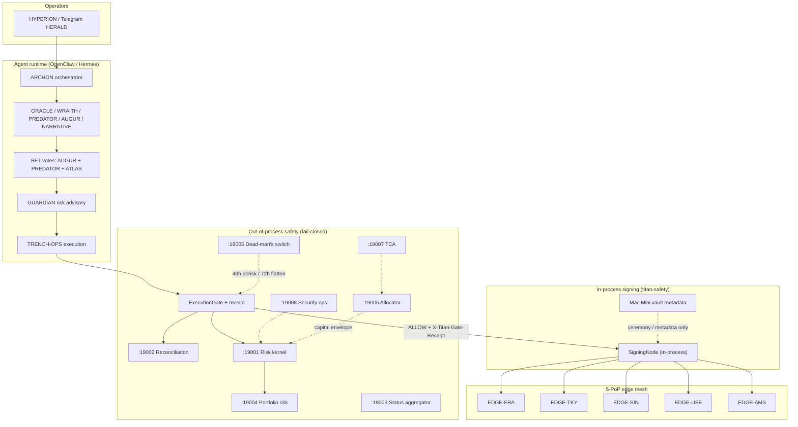
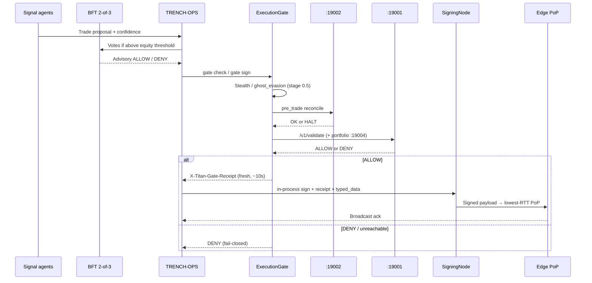

# SYSTEM.md — Titan / Titan Agentik System Manual

> **Primary system documentation.** Start here for architecture, agents, safety, trading flow, edge, stealth, capital, Telegram operations, and CLI.  
> Immutable constitutions remain in `SOUL.md` and `iron-laws.md`. Agent protocol detail lives in `AGENTS.md` / `TOOLS.md`.  
> This file synthesizes the deploy bundle; it does not replace those sources of truth.

---

## Table of contents

1. [What Titan is](#1-what-titan-is)
2. [System map](#2-system-map)
3. [Hardware / nodes](#3-hardware--nodes)
4. [Model tiers & inference ports](#4-model-tiers--inference-ports)
5. [20 agents + roles](#5-20-agents--roles)
6. [Trade lifecycle end-to-end](#6-trade-lifecycle-end-to-end)
7. [Risk kernel, CBs, drawdown, capital](#7-risk-kernel-cbs-drawdown-capital)
8. [Security four pillars + ghost + predatory](#8-security-four-pillars--ghost--predatory)
9. [Pipelines catalog vs selective activation](#9-pipelines-catalog-vs-selective-activation)
10. [Safety services ports map](#10-safety-services-ports-map)
11. [Telegram operator surface](#11-telegram-operator-surface)
12. [CLI essentials](#12-cli-essentials)
13. [Quantum path (classical-only)](#13-quantum-path-classical-only)
14. [Go-live / verify sequence](#14-go-live--verify-sequence)
15. [Explicit non-goals / hard exclusions](#15-explicit-non-goals--hard-exclusions)

---

## 1. What Titan is

**Titan (Titan Agentik)** is a local-first, capital-preservation-first crypto trading control plane: a multi-agent OpenClaw/Hermes runtime on operator hardware, gated by an **out-of-process risk kernel** and an **unbypassable execution gate**, with **in-process signing** in `titan-safety` after ExecutionGate ALLOW (legacy HTTP `:19010` optional only), broadcast via a **5-PoP edge mesh**. Agents propose; deterministic safety services veto. Catalog specs (pipelines, skills, pillars) are **not** a checklist to enable everything — selective activation funds a small set of HEALTHY lanes. Quantum agents (QCC/QSA/QRP) are **removed**; live path is classical GPU only (QI Optimizer is classical SA, not a quantum agent). **Telegram (HERALD)** is the sole operator surface — institutional alerts via `titan-safety notify` and the HERALD queue; the web cockpit is archived under `archive/cockpit-web/`.

---

## 2. System map



**Authoritative vs advisory**

| Layer | Role |
|-------|------|
| Risk kernel `:19001` + ExecutionGate receipt | **Authoritative** — DENY cannot be overridden by any LLM |
| Portfolio risk `:19004` | **Authoritative** pre-trade VaR/CVaR/correlation when wired into gate/kernel |
| BFT 2-of-3 (AUGUR/PREDATOR/ATLAS) | **Advisory** trade authorization; still blocked by kernel DENY |
| Telegram (HERALD) | **Notify-only** operator surface — cannot override kernel DENY |
| QI optimizer / classical SA | **Advisory only** — `live_path=false` |

---

## 3. Hardware / nodes

Specs: `templates/infra/hardware_bom.yaml`, `power_requirements.yaml`, `signing_node.yaml`, `edge_mesh.yaml`.

| Node | Role | Notes |
|------|------|-------|
| **TITANHOME** | Primary compute + inference + safety services | Threadripper PRO 9995WX, 512 GB ECC, 2× RTX PRO 6000 (96 GB), E810 NIC + LBE-1425 GPSDO, Eaton 9SX UPS **required for live** |
| **TITANSPARK** | Utility inference + gateway failover | ASUS GX10 — Qwen3-30B utility agents on `:30002` |
| **Mac Mini vault** | Key metadata + Trezor ceremonies | Does **not** execute trade signing; Telegram gateway primary often here |
| **Signing (in-process)** | `titan_safety.SigningNode` after gate ALLOW | Same TITANHOME safety process; no `:19010` hop; UPS-backed; fresh gate receipt required |
| **Edge mesh (5 PoP)** | Stateless TRENCH-OPS workers | FRA, TKY, SIN, USE, AMS — same routing for paper + live (`latency_faithful`) |

**Edge PoPs (summary)**

| PoP | Provider / region | Primary targets |
|-----|-------------------|-----------------|
| EDGE-FRA | Vultr BM, Frankfurt | Erigon, Jito-FRA, ETH builders, Solana-EU, Telegram relay |
| EDGE-TKY | AWS `ap-northeast-1` | Hyperliquid DEX, Jito-TKY |
| EDGE-SIN | AWS `ap-southeast-1` | BSC / PancakeSwap / Sui |
| EDGE-USE | AWS `us-east-1` | L2 sequencers, Flashbots Protect |
| EDGE-AMS | Vultr BM, Amsterdam | Solana gRPC redundancy, Nostr, bridges |

Routing policy: **lowest live p50 RTT** (`edge_mesh.yaml`). Dispatch path: TRENCH-OPS → Nostr NIP-44 (Kind 1059) → edge worker.

---

## 4. Model tiers & inference ports

From `templates/openclaw.json` `inference` + `hardware_bom.yaml`. **No closed/cloud models on the live path.**

| Tier | Port | Host / GPU | Model | Role |
|------|------|------------|-------|------|
| 1 Critical | `:30000` | TITANHOME GPU 0 | Qwen3-30B-A3B FP8 | Signals, GUARDIAN, TRENCH-OPS |
| 2 Reasoning | `:30001` | TITANHOME GPU 1 | Qwen3-Coder-Next-80B | ARCHON, SENTINEL, LAMARCK, orchestration |
| 3a R&D | `:30005` | Off-peak / offload | DeepSeek V4 Pro | CORTEX deep votes preferred; never TRENCH-OPS/GUARDIAN live |
| 3b R&D | `:30003` | Off-peak / offload | GLM-5.2 | Secondary R&D only |
| Utility | `:30002` | TITANSPARK | Qwen3-30B | HERALD, NEXUS, FORGE, ALCHEMY, ATLAS, QUANT, ARBITER, HORIZON |
| Embedder | `:30004` | TITANHOME | Qwen3-Embedding | Memory / retrieval |
| REVM sim | `:30020` | TITANHOME | Classical EVM sim | Pre-trade simulation (not quantum) |

**Confidence gate** (agents): ≥0.70 full size; 0.50–0.69 reduced; 0.30–0.49 escalate; &lt;0.30 reject (`openclaw.json` `confidenceGate`).

---

## 5. 20 agents + roles

Total: **12** LLM agents on TITANHOME tiers (4 orch + 5 signal + 3 coding) + **8** utility on TITANSPARK + **5** stateless edge workers (no LLM). Named agents in `openclaw.json` definitions = **20**. Quantum-coordination agents (QCC/QSA/QRP) removed — classical-only.

| Agent | Tier | Role |
|-------|------|------|
| **HYPERION** | Operator interface | Reporting / NATS off-critical path (operator-facing) |
| **ARCHON** | Tier 2 `:30001` | Orchestrator + A2A coordinator (BFT voter A at orchestrator layer) |
| **CORTEX** | `:30005` → fallback `:30001` | Meta-cognitive / GEPA / PRM; deep votes when available |
| **GUARDIAN** | Tier 1 `:30000` | Risk validation / Kelly sizing (critical path) |
| **SENTINEL** | Tier 2 `:30001` | Security audit / CodeQL / TPM PCR drift |
| **ORACLE** | Tier 1 | Signal generation (classical-only) |
| **WRAITH** | Tier 1 | On-chain analysis |
| **PREDATOR** | Tier 1 | Scanner / mempool / stalking / P22 filter |
| **AUGUR** | Tier 1 | Macro regime |
| **NARRATIVE** | Tier 1 | Catalyst / news ingestion |
| **TRENCH-OPS** | Tier 1 | Execution planning + edge dispatch; signs via in-process titan-safety |
| **LAMARCK** | Tier 2 | Post-trade learning / OPD / GEPA |
| **DARWIN_GODEL** | Tier 2 / R&D | Auto-research / DGM-H (**shadow only** until YES) |
| **HERALD** | Utility `:30002` | Telegram notifications |
| **NEXUS** | Utility | Data feeds / funding / AVS registry |
| **FORGE** | Utility | Infra / strategy-health / inference health |
| **ALCHEMY** | Utility | DeFi ops / liquidations / flash-loan compose |
| **ATLAS** | Utility | Portfolio / sweeps / BFT voter |
| **QUANT** | Utility | Stats / pairs / pred-market models |
| **ARBITER** | Utility | Backtest gate / Red Team / deploy lifecycle |
| **HORIZON** | Utility | R&D metrology (observer only — cannot trade) |

**Trade BFT (advisory):** AUGUR + PREDATOR + ATLAS, threshold **2-of-3**. Orchestrator-tier heterogeneous votes (ARCHON / CORTEX / GUARDIAN) are documented separately; **kernel DENY wins**.

---

## 6. Trade lifecycle end-to-end

Bounded autonomy: routine trades &lt;1% equity may auto-execute; &gt;1% requires BFT votes when `autonomous_signing` is enabled (human YES still required for promotion, evolution, leverage, flash-loan live, large withdrawals). See matrix in §7.



**Stages (code path: `execution_gate.py` → `signing_service.py` → edge)**

1. **Signal / debate** — multi-analyst evidence + optional bull/bear (see `AGENTS.md`); classical only.
2. **Confidence + BFT** — size by confidence; attach votes when required (`titan-safety bft vote`).
3. **Stealth check** — deny public RPC / unshielded venues (`STEALTH_*` codes).
4. **Reconciliation** — believed vs adapter positions; divergence → HALT.
5. **Risk kernel** — notional, leverage, velocity, venue/contract allow-list, human/BFT gates, kill switch, power-loss, etc.
6. **Gate receipt** — binds `trade_id` + notional + venue + contract; max age ~10s.
7. **Signing node** — rejects blind sign / missing receipt; live requires EIP-712 typed_data or calldata.
8. **Edge** — route by venue/strategy (`titan-safety edge route`); Nostr dispatch to worker.

Mock recon/withdrawal adapters are **forbidden** when `capital_profile: live`.

---

## 7. Risk kernel, CBs, drawdown, capital

### Bounded autonomy matrix (enforced)

| Action | Auto-execute | Human YES |
|--------|--------------|-----------|
| Routine trade &lt;1% equity | YES | — |
| Trade &gt;1% equity | BFT path (autonomous_signing) | Promotion-style human gates still for strategy/evolution/etc. |
| Rebalance &lt;1% equity | YES | — |
| New pipeline activation | — | YES |
| Model/skill promotion to live | — | YES (Phase 5) |
| Evolution deploy (DGM-H, GEPA, …) | Shadow only | YES for live |
| Leverage change | — | YES |
| Flash-loan live | — | YES |
| CB tier response (within policy) | YES | — |
| Drawdown velocity breach | HALT (kernel) | Alert operator |
| TIMEOUT on promotion prompt | HOLD/de-risk | Never auto-promote |
| Security lockdown | — | YES (HMAC) |
| Withdrawal &gt;20% equity | — | YES |

Policy: `templates/risk_kernel/policy.yaml`. Kernel mode: **enforce**, fail-closed if unreachable.

### Drawdown & velocity

- **Tier notifications** (2 / 5 / 8 / 10 / 12%): with `drawdown_notify_only: true`, HERALD alerts fire but **trading continues** (operator doctrine in current policy).
- **Velocity breakers** (60s / 15m loss caps): still **HALT** — independent of 24h PnL.
- **Volatile-exempt** lanes (P22, P29, P30, P12): portfolio drawdown tiers do not apply; lane-local memecoin/MEV CBs + velocity still apply.

### Capital / allocator / TCA / sweeps

| Component | Port / module | Behavior |
|-----------|---------------|----------|
| Capital ledger | `titan_safety.capital` | Deposit/withdraw/sweep audit chain; min reserve |
| Allocator | `:19006` | Fractional-Kelly within human gross envelope; `max_active_pipelines` default **4**; `advisory_mode` until Phase 2+ |
| TCA | `:19007` | Net-of-cost scorecards; BLEEDING lanes flagged |
| Profit loop | `profit_loop.py` | Auto-defund BLEEDING; refund needs human |
| Weekly sweep (R23) | ATLAS / capital CLI | 20% of weekly profit to Trezor Safe 7 when portfolio ≥$15K; 100% reinvest below |

### Dead-man's switch

- Heartbeat miss **&gt;48h** → de-risk; **&gt;72h** → flatten.
- Never auto-promotes. CLI: `titan-safety heartbeat`.

### Kill / wind-down / evolution freeze

- Global kill file flag + signed RESUME to deactivate.
- Wind-down: safe-mode → derisk → flatten.
- Evolution freeze while live capital: blocks live promotions (`titan-safety evolution status`).

---

## 8. Security four pillars + ghost + predatory

Always-on posture (`securityOps` in `openclaw.json`, `security_ops.py`, `ghost_evasion.yaml`). Doctrine: **invisible to them, visible to us**.

| Pillar | Owner | Core controls |
|--------|-------|---------------|
| **Impenetrable** | SENTINEL | L1 kernel, L2 signing in-process, L3 netns, L4 PCR/CodeQL, L5 DMS, L6 closed-model ban |
| **Evasion (Ghost)** | TRENCH-OPS | MEV-shield / intents, edge RTT, Nostr NIP-44, fingerprint rotate, traffic jitter, air-gapped vault metadata |
| **Stalking** | PREDATOR | Hunt mode default; mempool / copy-trade / RPC probe feeds |
| **Predatory** | PREDATOR | Honeypot lattice armed by default; poison fills ≤1% equity auto; Graph-R1 fraud checks |

**Forbidden live paths:** public RPC pools, public mempool, unshielded CEX-direct venues → kernel codes `STEALTH_PUBLIC_PATH` / `STEALTH_UNSHIELDED_VENUE`.

**Lockdown:** `titan-safety security lockdown` — kill + evolution freeze + signing halt + honeypot arm; requires operator **HMAC** (never LLM-alone).

---

## 9. Pipelines catalog vs selective activation

**Catalog ≠ checklist.** `autonomy.selectiveActivation: true` and allocator `max_active_pipelines: 4` — fund few HEALTHY lanes.

Representative lanes (from cockpit data + edge routing; not an exhaustive live enable list):

| ID | Name | Notes |
|----|------|-------|
| P1 | DEX cross-venue arb | EDGE-FRA |
| P3 | Cross-rollup arb | Flash-composed; paper until promoted |
| P5 | DEX funding carry | EDGE-TKY (Hyperliquid) |
| P6 | Liquidation hunter | ALCHEMY compose |
| P12 | Intent solver | Stealth pipeline; MEV-shielded |
| P22 | Memecoin trench | **Gated:** `memecoinTrench.enabled: false` until Phase 5 YES + live profile + Solana infra |
| P29 / P30 | MEV bundle / cross-chain MEV | Stealth; TCA may defund BLEEDING |
| P7 / P8 / P11 / P18 … | Pairs, APAC DEX, pred markets, macro | Catalog — activate only with evidence |

**Hard gates before capital**

- P22: promotion YES + `memecoinTrench.enabled` + Geyser/Jito wiring (`solana_memecoin.yaml`).
- Flash-loan live: `flashloan sim` + promotion `flash_loan_live` YES + `flashLoanRouter.enabled`.
- Statistical promotion: deflated Sharpe / PSR / cost realism / ≥200 trades / shadow divergence (`promotion_stats`).

---

## 10. Safety services ports map

| Port | Service | Key endpoints |
|------|---------|---------------|
| **19001** | Risk kernel | `/v1/validate`, `/health`, `/metrics` |
| **19002** | Reconciliation | `/v1/pre_trade`, `/health` |
| **19003** | Status aggregator | `/health`, `/status`, `/metrics` |
| **19004** | Portfolio risk | `/v1/simulate`, `/v1/var`, `/health` |
| **19005** | Dead-man's switch | `/v1/heartbeat`, `/health` |
| **19006** | Capital allocator | `/v1/allocate`, `/v1/plan`, `/health` |
| **19007** | TCA / execution quality | `/v1/ingest`, `/v1/scorecard`, `/health` |
| **19008** | Security ops | `/v1/status`, `/health` |
| **19010** | Signing (legacy optional) | HTTP `/v1/sign` only if `signing.mode=http` — **not** required; default is in-process `titan_safety.SigningNode` |
| **18789** | OpenClaw gateway | Telegram / agent gateway |
| **19100** | Edge worker (per PoP) | Stateless broadcast workers |

Control-plane mutating POSTs require `X-Titan-Auth` HMAC when `control_plane.auth_required: true`.

---

## 11. Telegram operator surface

**Guide:** [`TELEGRAM_OPS_GUIDE.md`](./TELEGRAM_OPS_GUIDE.md)

HERALD delivers institutional-grade Telegram messages for all operational events: clear title, severity, ISO 8601 timestamp, agent ID, description, structured details, and action required. Module: `templates/safety/titan_safety/telegram_notify.py`.

```bash
# Configure ~/.openclaw/.env (never commit)
# TELEGRAM_BOT_TOKEN=...
# TELEGRAM_CHAT_ID=...

titan-safety notify test
titan-safety notify send --title "Drill" --event-type notify_test --description "..."
titan-safety notify drain
titan-safety capital balance --telegram
```

| Event category | Delivery |
|----------------|----------|
| Risk kernel / gate DENY | Immediate HIGH/CRITICAL |
| Drawdown tier cross | Immediate; trading continues unless HALT |
| Kill switch / pipeline halt | CRITICAL |
| Signing success/fail | MEDIUM / CRITICAL |
| Promotion / Phase 5 gate | HIGH / CRITICAL on YES |
| Trezor weekly sweep | HIGH on execution |
| Security lockdown | CRITICAL via herald queue |

Queue file: `~/.openclaw/safety/herald_queue.jsonl`. Capital commands: `/balance`, `/deposit`, `/withdraw`, `/sweep`.

**Archived cockpit:** `archive/cockpit-web/` — not supported for production. Legacy web UI guides remain for reference only.

---

## 12. CLI essentials

Binary: `titan-safety` (deployed under `~/.openclaw/safety/bin/` after install).

```bash
# Health
curl -s http://127.0.0.1:19003/health | python3 -m json.tool

# Kill switch drill
titan-safety kill activate --operator YOU --reason "drill"
titan-safety kill status
titan-safety kill sign --command RESUME --operator YOU
titan-safety kill deactivate --operator YOU --signed "$SIGNED"

# Gate + autonomous sign path
titan-safety gate check --trade-json '...'
titan-safety gate sign --trade-json '...'
titan-safety bft vote --voter AUGUR --trade-id ... 

# Capital / allocator / TCA
titan-safety capital balance
titan-safety capital sweep
titan-safety allocator plan ...
titan-safety tca scorecard
titan-safety tca profit-loop

# Security / DMS / evolution
titan-safety security status
titan-safety security lockdown --dry-run
titan-safety heartbeat
titan-safety evolution status

# Edge / gated strategies
titan-safety edge route --venue jito --strategy P22
titan-safety memecoin filter|evaluate|sim|status
titan-safety flashloan sim|status
titan-safety qi demo   # advisory classical SA — not live path

# Promotion
titan-safety promotion approve --response YES ...

# Telegram (HERALD)
titan-safety notify test
titan-safety notify drain
titan-safety capital balance --telegram
titan-safety promotion-stats --stats '...'
```

Wind-down: `titan-safety wind-down safe-mode|derisk|flatten|status`.

---

## 13. Quantum path (classical-only)

| Item | Status |
|------|--------|
| QCC / QSA / QRP | **Removed** from agent catalog (`openclaw.json` definitions) |
| `quantum.enabled` / `quantum.status` | `false` / `dormant` (policy flag retained) |
| cuQuantum / Wukong / cloud QPU | Disabled for live capital |
| QI Optimizer (`quantum_inspired.py`) | Classical simulated annealing only; `advisory_only`, `live_path=false` — not a quantum agent |
| Randomness | OS CSPRNG |

**Why:** Live capital is classical-only (REVM / CuEVM / ML). Quantum agents are not in the system catalog. Re-introducing QPU dispatch requires full re-audit and explicit operator sign-off (`iron-laws.md` §8).

---

## 14. Go-live / verify sequence

Do **not** treat deploy as go-live. Follow these in order:

1. **`BOOTSTRAP.md`** — first-run ritual (hardware, inference, NATS, UPS, safety units).
2. **`./deploy.sh`** — build/install templates; optional `--systemd`, `--start-services`, `--verify`, `--edge-bootstrap`.
3. **`./verify.sh`** — bootstrap limits, config presence, safety/unit checks (fails live-capital checks without UPS ack when configured).
4. **`PRODUCTION_READINESS.md`** — fail-closed drills, kill switch, recon adapter, in-process signing isolation, quantum agents removed / `quantum.enabled=false`, residual risk acceptance.
5. **`BOOT.md`** — short gateway-restart checklist (health `:19001`–`:19008`; in-process signing; no auto-promote).
6. **Phased rollout** — paper → micro-live → scale; calendar is **advisory** (`rollout.calendarIsNotAGate: true`); Phase 5 always needs human YES.
7. Beginner/ops narratives: `DEPLOYMENT_GUIDE.md`, `DEPLOYMENT_GUIDE_BEGINNER.md`, `TITAN_AGENTIK_COMPLETE_SETUP_GUIDE.md`.
8. **Live capital (real money):** [`LIVE_CAPITAL_PRODUCTION_GUIDE.md`](./LIVE_CAPITAL_PRODUCTION_GUIDE.md) — paper → shadow → Phase 5 YES → first live trade; does **not** bypass `:19001` or auto-promote.

**Minimum software proof before real capital:** safety units healthy via `:19003`, kernel DENY when stopped, kill drill, DMS heartbeat, signing receipt gate, paper/shadow evidence ≥3 days + statistical promotion gate + Phase 5 YES.

---

## 15. Explicit non-goals / hard exclusions

| Non-goal / exclusion | Rationale |
|----------------------|-----------|
| Enable every pipeline/skill/pillar in docs | Catalog ≠ checklist; concentration cap |
| LLM override of kernel DENY | Absolute (`iron-laws.md`) |
| Auto-promote on TIMEOUT | HOLD/de-risk only |
| Closed/cloud models on live path | TRENCH-OPS / GUARDIAN / EXECUTOR / live votes |
| Quantum dispatch for live capital | Permanently dormant until re-audit |
| Public RPC / unshielded venues on live | Ghost evasion + kernel DENY |
| Signing inside agent runtime | Must use titan-safety SigningNode + gate receipt (never LLM process) |
| Mock recon/withdraw adapters on live profile | Banned at startup |
| Auto security lockdown from LLM alone | HMAC operator required |
| Modify `SOUL.md` / `iron-laws.md` via DGM-H | Immutable; CRITICAL + rollback |
| Cockpit fixture data as ground truth | Fixtures until APIs wired |
| This repo alone making live trading “safe” | Necessary software controls ≠ sufficient ops |

---

## Related files (quick index)

| Path | Contents |
|------|----------|
| `SOUL.md` / `iron-laws.md` | Immutable identity + constitution |
| `AGENTS.md` / `TOOLS.md` | Agent protocol + capability matrix |
| `templates/openclaw.json` | Runtime config template |
| `templates/risk_kernel/policy.yaml` | Kernel / allocator / TCA / security policy |
| `templates/safety/titan_safety/` | Enforceable Python safety stack |
| `templates/infra/` | BOM, edge, ghost, power, signing, Solana |
| `PRODUCTION_READINESS.md` | Honest go-live gates + residual risks |
| `LIVE_CAPITAL_PRODUCTION_GUIDE.md` | End-to-end real-capital go-live (gates documented; no silent enable) |
| `TELEGRAM_OPS_GUIDE.md` | Telegram operator surface (sole UI) |
| `archive/cockpit-web/` | Archived web cockpit (reference only) |

---

*Generated for the titan-deploy bundle. Prefer updating this file when architecture ports, autonomy matrix, or enforce paths change — keep SOUL/iron-laws untouched.*
