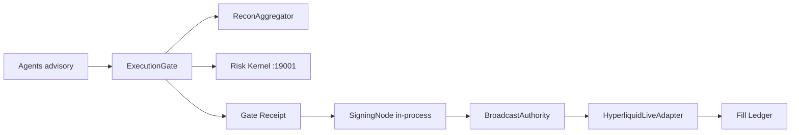

# Tier 0 Money Path — Authoritative Spec

> **Status:** Implemented in `titan-deploy` (July 2026). Does **not** auto-enable live capital or Phase 5.  
> **Venue chosen:** **Hyperliquid** (depth-first). Solana/Jito/P22/Flashbots explicitly deferred.

## Overview

Tier 0 makes the money path **real but gated**: one broadcast authority, one venue adapter end-to-end, built-in recon, policy-bound signing, and idempotent flatten/resume.



---

## 1. One broadcast authority

| Requirement | Code | Status |
|-------------|------|--------|
| Only TRENCH-OPS / execution daemon submits txs | `titan_safety/broadcast_authority.py` | **DONE** |
| Agents never hold hot keys | `AGENT_CALLER_DENY` + `validate_broadcast_caller()` | **DONE** |
| Kernel ALLOW + gate receipt + payload hash bound to calldata | `gate_receipt.py`, `trade_verifier.py`, `broadcast_authority.py` | **DONE** |

**Env / policy**

| Key | Purpose |
|-----|---------|
| `tier0_money_path.broadcast_authority_enforced` | `true` — deny non-allowlist callers |
| `tier0_money_path.agent_submit_denied` | `true` — block ARCHON/ORACLE/… submit |
| `tier0_money_path.allowed_callers` | `trench-ops`, `execution_daemon`, `flatten_executor` |

**Gate codes:** `BROADCAST_CALLER_DENIED`, `GATE_RECEIPT_INVALID`, `PAYLOAD_HASH_MISMATCH`

---

## 2. One venue adapter (Hyperliquid)

| Stage | Module | Status |
|-------|--------|--------|
| Quote | `adapters/hyperliquid_live.py::quote` | **DONE** (public info API) |
| Simulate | `hyperliquid_live.py::simulate` | **DONE** |
| Sign | `hyperliquid_live.py::sign` → in-process `SigningNode` | **DONE** |
| Submit | `hyperliquid_live.py::submit` | **STUB** (needs session key / bridge) |
| Confirm | `hyperliquid_live.py::confirm` | **STUB** |
| Fill ledger | `hyperliquid_fill_ledger.jsonl` | **DONE** |

**Deferred:** `solana_jupiter`, `jito`, `solana_pumpfun`, `flashbots_protect` — listed in `tier0_money_path.deferred_venues`.

**Policy:** `tier0_money_path.venue_adapter: titan_safety.adapters.hyperliquid_live:HyperliquidLiveAdapter`

---

## 3. Live signer (session keys / Trezor)

| Requirement | Code | Status |
|-------------|------|--------|
| Typed data required on live | `trade_verifier.verify_sign_payload` | **DONE** |
| Blind sign DENY | `signing_service.py` + `live_bundle.live_signer` | **DONE** |
| Session notional envelope | `tier0_money_path.session_envelope` | **DONE** |
| Trezor / HSM delegation | `live_bundle.live_signer` | **STUB** (bridge RPC) |
| Dual-control withdrawals | `tier0_money_path.dual_control_withdrawals` | **POLICY** |

**Env**

| Variable | Required for live sign |
|----------|------------------------|
| `TITAN_LIVE_SIGNING_READY=1` | Arm switch (fail-closed until set) |
| `TREZOR_BRIDGE_SOCKET` | Trezor policy-bound typed data |
| `HYPERLIQUID_WALLET_ADDRESS` | Wallet metadata |

---

## 4. Position recon (built-in, not HTTP-only)

| Source | Module | Status |
|--------|--------|--------|
| HTTP override | `TITAN_RECON_FETCHER_URL` | **DONE** (optional) |
| Hyperliquid clearinghouse | `recon_aggregator.fetch_hyperliquid_positions` | **DONE** |
| EVM DEX positions | `recon_aggregator.fetch_evm_positions_stub` | **STUB** |
| HALT on divergence | `reconciliation.py::_on_divergence_halt` | **DONE** |

**Policy:** `reconciliation.recon_halt_on_divergence: true`, `tier0_money_path.builtin_aggregator: true`

**Env:** `HYPERLIQUID_WALLET_ADDRESS` (read-only recon, no hot key)

**Kernel path:** Reconciliation `HALT` → ExecutionGate `DENY` (`RECON_DENY` / `DIVERGENCE_*`) + `SIGNING_HALTED` file.

---

## 5. Flatten / revoke (real path)

| Requirement | Code | Status |
|-------------|------|--------|
| Close via broadcast authority | `flatten_executor.BroadcastAuthorityCloser` | **DONE** |
| Idempotent resume | `flatten_executor.resume_flatten` + `flatten_resume_state.json` | **DONE** |
| Revoke session keys | `live_bundle.revoke_session_keys` | **STUB** (policy + halt + HERALD) |
| Chaos: kill mid-flatten | `resume_flatten()` | **DONE** (state machine) |

**Policy:** `flatten.closer: broadcast_authority`, `flatten.revoker: live_bundle:LiveKeyRevoker`

---

## Policy block (`policy.yaml`)

```yaml
tier0_money_path:
  enabled: false  # operator after Phase 5 YES
  venue: hyperliquid
  broadcast_authority_enforced: true
  recon_halt_on_divergence: true
  builtin_aggregator: true
  session_envelope:
    enabled: false
    max_notional_usd: 500.0
    allowed_venues: [hyperliquid]
```

---

## Operator checklist — go live on Hyperliquid (ONE venue)

1. **Phase 5 human YES** — do not set `tier0_money_path.enabled: true` before this.
2. Copy `templates/infra/live.env.example` → `~/.openclaw/.env`.
3. Set `HYPERLIQUID_WALLET_ADDRESS` (recon read-only).
4. Verify recon: `curl` reconciliation `/v1/reconcile` or `titan-safety` health — positions match believed book.
5. Wire Trezor bridge per `~/.openclaw/infra/signing_node.yaml`.
6. Set `TITAN_LIVE_SIGNING_READY=1` only after bridge health OK.
7. Enable `tier0_money_path.enabled: true` and `session_envelope.enabled: true` with notional cap.
8. Paper-trade Hyperliquid path: quote → sim → sign (mock/stub submit) for 3+ days.
9. Wire `hyperliquid_live.submit` exchange POST (session key on HSM policy).
10. Run chaos test: start flatten, kill process, `resume_flatten()` → flat.
11. Confirm `SIGNING_HALTED` on recon divergence (inject test mismatch).

**Hard rules unchanged:** Risk kernel DENY authoritative; in-process signing default; no mandatory `:19010`; DEX-only; shadow evolution unchanged.

---

## File index

| File | Role |
|------|------|
| `templates/safety/titan_safety/broadcast_authority.py` | Single submitter |
| `templates/safety/titan_safety/recon_aggregator.py` | Built-in HL + EVM stub |
| `templates/safety/titan_safety/adapters/hyperliquid_live.py` | Venue adapter |
| `templates/safety/titan_safety/gate_receipt.py` | Receipt + payload hash |
| `templates/safety/titan_safety/trade_verifier.py` | Blind sign + envelope |
| `templates/safety/titan_safety/flatten_executor.py` | Broadcast flatten + resume |
| `templates/safety/titan_safety/adapters/live_bundle.py` | live_signer + revoke |
| `templates/risk_kernel/policy.yaml` | `tier0_money_path` section |
| `tests/test_tier0_money_path.py` | Unit tests (mock chain) |

---

## Tests

```bash
cd /path/to/titan-deploy
python -m pytest tests/test_tier0_money_path.py -v
```
